# Adaptive Bitrate Video Player

A sophisticated web-based video player with advanced adaptive bitrate (ABR) streaming capabilities, implementing multiple ABR algorithms including BOLA (Buffer Occupancy based Lyapunov Algorithm) for optimal streaming quality.

## 🎯 Features

- **Multiple ABR Strategies**

  - Bandwidth-based adaptation with Network Information API support
  - Buffer-based adaptation using BOLA algorithm
  - Dropped frames detection for emergency quality reduction
  - Dynamically switched between BOLA and the Bandwidth-based algorithm depending on buffer health and network activities

- **Smart Quality Switching**

  - Smoothing algorithm to prevent quality oscillations
  - Configurable cooldown periods between switches
  - Hysteresis to avoid frequent quality changes

- **Advanced Bandwidth Estimation**

  - Dual EWMA (Exponentially Weighted Moving Average) with different half-lives
  - Network Information API integration for better initial estimates
  - Minimum sample thresholds for accurate measurements
  - **Cache-aware bandwidth measurement**: Distinguishes between cached and network-delivered content
  - **Performance API integration**: Accurate transfer size detection using PerformanceResourceTiming
  - **Intelligent cache detection**: Multiple heuristics to identify CDN/browser cached segments
  - **Filtered sampling**: Excludes cached content from bandwidth calculations to prevent inflated estimates

- **Fast Switching**: Quickly replace buffered low-quality segments with higher-quality ones, improving visual responsiveness during upswitches

- **Gap detection and robust stall recovery**

- **Custom logger with extensive debugging capabalities**

- **Real-time analytics with detailed logging and interactive charts for performance insights**

- **Event System**: The player uses an event bus for component communication

- **Intelligent Filtering**: Filters video representations based on screen resolution and device pixel ratio

- **BIF (Base Index Frames) thumbnail support**

- **DASH Support**
  - MPEG-DASH manifest parsing and playback
  - MediaSource Extensions (MSE) based streaming

## Usage

### Basic Setup

```
import { Player } from "./Player.js";

const title = "Your Video Title";
const manifestUrl = "http://localhost:8000/path/to/manifest.mpd";
const bifUrl = "http://localhost:8000/path/to/thumbnails.bif";

const player = new Player(title, manifestUrl, bifUrl);

window.onload = () => {
  player.startup();
};
```

## 🏗️ Architecture

### Core Components

- **Player**: Main orchestrator that initializes MediaSource, UI, and manages playback lifecycle
- **AbrController**: Central ABR management, strategy selection, and quality switching decisions
- **ScheduleController**: Manages segment scheduling and buffering
- **BufferController**: Handles buffer management and monitoring
- **PlaybackController**: Controls video playback state and current quality

### ABR Strategies

**1. Bandwidth ABR** `(BandwidthAbr.ts)`
<br>Uses dual EWMA approach:

- **Fast EWMA**: 2-second half-life for quick adaptation
- **Slow EWMA**: 5-second half-life for stability
- Takes minimum of both estimates for conservative approach
- Selects highest quality that fits within bandwidth constraints
- Integrates with Network Information API for quick adaptation
- Considers playback rate
- **Cache-aware bandwidth measurement**: Distinguishes between cached and network-delivered content

**2. Buffer ABR (BOLA)** `(BufferAbr.ts)`

- Implements the BOLA algorithm for buffer-based adaptation
- **Three states**: STARTUP, STEADY_STATE, ONE_BITRATE:
- **Startup Phase**: Uses throughput-based selection initially
- **Steady State**: Optimizes quality based on buffer occupancy
- **ONE_BITRATE**: Skips descision making logic and chooses the only available bitrate
- **Placeholder Buffer**: Accounts for non-download time (processing, rendering)
- Uses utility theory to optimize quality selection based on buffer levels
- **Hysteresis**: Applies safety factors to prevent oscillations

**3. Dropped Frames ABR** `(DroppedFramesAbr.ts)`

- Emergency quality reduction when frames are being dropped
- Monitors frame drop rate and downgrades quality when threshold exceeded
- Prevents playback stuttering due to performance issues

### Quality Selection Process `(AbrController.ts)`

- **Dropped Frames Check**: First checks if emergency downgrade is needed
- **Strategy Selection**: Chooses between Buffer or Bandwidth strategy based on buffer level
- **Quality Smoothing**: Applies smoothing to prevent oscillations (if enabled)
- **Cooldown Enforcement**: Ensures minimum time between quality changes

**Quality Selection Flow**

```mermaid
graph TD
    A[Start Quality Check] --> B{Dropped Frames<br/>Check}
    B -->|Frames Dropping| C[Emergency<br/>Downgrade]
    B -->|No Issues| D{Buffer Level<br/>Check}

    C --> H[Quality Selected]

    D -->|Buffer < 10s| E[Bandwidth<br/>Strategy]
    D -->|Buffer ≥ 10s| F[Buffer<br/>Strategy<br/>BOLA]

    E --> G{Smoothing<br/>Enabled?}
    F --> G

    G -->|Yes & Active| I[Apply<br/>Smoothing]
    G -->|No or Inactive| J[Skip<br/>Smoothing]

    I --> K{Same Quality<br/>After Smoothing?}
    J --> L{Same Quality<br/>as Current?}

    K -->|Yes| M[No Change<br/>Needed]
    K -->|No| N{Cooldown<br/>Check}

    L -->|Yes| M
    L -->|No| N

    N -->|Within Cooldown| O[Prevent Switch<br/>Return False]
    N -->|Cooldown Passed| P[Trigger Quality<br/>Change Event]

    M --> Q[Return False]
    O --> Q
    P --> R[Update State<br/>Return True]

    H --> G

    style A fill:#e1f5fe,color:#000
    style B fill:#fff3e0,color:#000
    style C fill:#ffebee,color:#000
    style D fill:#fff3e0,color:#000
    style E fill:#e8f5e9,color:#000
    style F fill:#e8f5e9,color:#000
    style G fill:#fff3e0,color:#000
    style H fill:#f3e5f5,color:#000
    style I fill:#e8eaf6,color:#000
    style J fill:#e8eaf6,color:#000
    style K fill:#fff3e0,color:#000
    style L fill:#fff3e0,color:#000
    style M fill:#ffebee,color:#000
    style N fill:#fff3e0,color:#000
    style O fill:#ffebee,color:#000
    style P fill:#c8e6c9,color:#000
    style Q fill:#ffcdd2,color:#000
    style R fill:#c8e6c9,color:#000
```



### Cache-Aware Bandwidth Measurement

The player implements sophisticated cache detection to ensure accurate bandwidth estimation:

- **Performance API Integration**: Uses `PerformanceResourceTiming` to get actual network transfer sizes
- **Multi-method Cache Detection**:
  - HTTP 304 responses detected as cache hits
  - Transfer size analysis (0 bytes or <10% of resource size indicates caching)
  - CDN cache headers (CF-Cache-Status, X-Cache)
- **Bandwidth Sampling Filters**:
  - Minimum duration threshold (50ms) to exclude cached responses
  - Maximum bandwidth threshold to filter outliers
  - Significant network change detection for Network Information API
- **Accurate Metrics**: Distinguishes between `transferredBytes` (actual network) and `resourceBytes` (full content size)

### Network Information API

The player automatically uses Network Information API when available:
<br>The player will use navigator.connection.downlink for initial bandwidth estimates and quick adaptation on network changes

### Creating BIF Files

For thumbnail/trickplay support, create BIF files using Roku's tools:<br>
[BIF file creation using the Roku BIF tool](https://developer.roku.com/de-de/docs/developer-program/media-playback/trick-mode/bif-file-creation.md)

## 🛠️ Development Tools

### Event Bus System

The player uses a centralized event bus for decoupled communication between components, implementing a publish-subscribe pattern with advanced features.

#### Core Features

- **Priority-based execution**: Handlers execute in priority order
- **Scoped handlers**: Bind handlers to specific object contexts
- **One-time listeners**: Auto-remove handlers after execution
- **Filtered events**: Target specific streams or media types

#### Basic Usage

```javascript
import { eventBus } from "./Events/EventBus.js";
import { Events } from "./Events/Events.js";

// Standard event listener
eventBus.on(
  Events.BUFFER_EMPTY,
  (payload) => {
    console.log("Buffer empty event:", payload);
  },
  this
);

// One-time listener
eventBus.once(
  Events.MANIFEST_PARSED,
  (payload) => {
    console.log("Manifest parsed:", payload);
  },
  this
);

// High-priority listener (executes first)
eventBus.on(
  Events.QUALITY_CHANGE_REQUESTED,
  (payload) => {
    console.log("High priority handler");
  },
  this,
  { priority: 5000 }
);

// Trigger events
eventBus.trigger(Events.VIDEO_BITRATE_CHANGED, {
  videoRepresentation: newQuality,
  switchReason: "Bandwidth",
});

// Remove listener
eventBus.off(Events.BUFFER_EMPTY, handlerFunction, this);
```

**Advanced Features**

```javascript
// Filtered events by stream/media type
eventBus.trigger(
  Events.SEGMENT_LOADED,
  {
    segmentRef: segment,
    byteCount: 1024000,
  },
  {
    streamId: 1,
    mediaType: "video",
  }
);

// Event payload interface
interface Payload {
  type?: string; // Auto-set by trigger
  mediaType?: MediaType; // "video" | "audio"
  streamId?: number; // Stream identifier
  videoRepresentation?: VideoRepresentation;
  audioRepresentation?: AudioRepresentation;
  bufferLevel?: number;
  switchReason?: AbrStrategyType | "Start" | "ChosenByUser";
  error?: Error;
  // ... and more
}
```

### Assertion Utility

The player includes a comprehensive assertion utility that helps catch bugs during development while being completely removable in production builds through tree-shaking.

#### Features

- **Zero-cost in production**: All assertions can be stripped out during build
- **Detailed error messages**: Includes stack traces and caller location
- **Multiple assertion types**:

```javascript
import { Assert, AssertConfig } from "./utils/assertion.js";

// Basic assertions
Assert.assert(condition, "Custom error message");
Assert.assertDefined(value, "Value must be defined");

// Type checking
Assert.assertType < string > (value, "string", "Expected string");
Assert.assertInstanceOf(value, VideoRepresentation);

// Range and array validation
Assert.assertInRange(value, 0, 100, "Value out of range");
Assert.assertNotEmpty(array, "Array cannot be empty");

// Unreachable code
Assert.fail("This code should never be reached");
```

**Production Optimization**

```javascript
// Disable assertions globally (for production)
AssertConfig.setEnabled(false);

// Or use build tools to strip Assert.* calls entirely
// Example with Terser/ESBuild:
{
  drop: ['Assert.assert', 'Assert.assertDefined', /* ... */],
  pure_funcs: ['Assert.assert', 'Assert.assertDefined', /* ... */]
}
```

### Configurable Logging System

The player features a sophisticated logging system with multiple configuration options:

**Log Levels**

```javascript
import { logger } from "./Logger.js";

// Configure log level
logger.setLevel("WARN"); // Only WARN, ERROR, and CRITICAL messages

// Available levels (in order):
// DEBUG < INFO < WARN < ERROR < CRITICAL
```

**Advanced Configuration**

```javascript
const customLogger = new Logger({
  level: "DEBUG", // Minimum log level
  useColors: true, // Colored console output
  timestampFormat: "ISO", // "ISO" or "LOCALE"
  prefix: "MyComponent", // Logger prefix
  includeSourceLocation: ["ERROR", "CRITICAL"], // Show file:line:column
  stackTraceEnabled: ["CRITICAL"], // Include stack traces
  maxStackFrames: 10, // Limit stack trace depth
});

// Create child loggers with inherited settings
const childLogger = logger.createChild("BufferManager");
// Logs as: [timestamp] [MyComponent:BufferManager] [LEVEL]: message
```

**Usage Examples**

```javascript
// Different log levels with automatic styling
logger.debug("Detailed debugging information", { data });
logger.info("General information");
logger.warn("Warning: approaching buffer threshold");
logger.error("Error occurred", error);
logger.critical("Critical failure - system unstable");

// Freeze/unfreeze logging via event bus
eventBus.trigger(Events.FREEZE_LOGGING); // Toggle logging on/off
```

**Production Considerations**

```javascript
// For production builds, configure minimal logging:
logger.setLevel("ERROR"); // Only errors and critical issues
logger.setUseColors(false); // Disable colors for log aggregation
```

**The logging system provides:**

- **Hierarchical loggers**: Create child loggers with prefixes
- **Contextual information**: Optional source location and stack traces
- **Performance control**: Disable debug logs in production
- **Visual clarity**: Color-coded messages by severity
- **Flexible output**: ISO or locale timestamps

## 📚 Further Reading

- [Fraunhofer: Future Applications and Media – Video Development Blog](https://websites.fraunhofer.de/video-dev/)
- [From Theory to Practice: Improving Bitrate Adaptation in the DASH Reference Player](https://dl.acm.org/doi/fullHtml/10.1145/3336497)
- [BOLA: Near-Optimal Bitrate Adaptation for Online Videos](https://www.akamai.com/site/en/documents/technical-publication/bola-near-optimal-bitrate-adaptation-for-online-videos.pdf)
- [Netflix Technology Blog](https://netflixtechblog.medium.com/)
- [Netflix' OPEN SOURCE CONTENT](https://opencontent.netflix.com/)
- [Media Source Extensions (MSE) docs](https://www.w3.org/TR/media-source-2/)
- Reference implementations:
  - [dash.js Github](https://github.com/Dash-Industry-Forum/dash.js)
  - [shaka-player Github](https://github.com/shaka-project/shaka-player)
- YouTube:
  - [Netflix JavaScript Talks - Making Bandersnatch](https://youtu.be/WLqc0EX8Bmg?list=LL)
  - [Live Streaming Architecture(Like:YouTube MPEG-DASH) Part 1](https://www.youtube.com/watch?v=l2Bisf2N1a4&list=LL&index=214&t=8s)
  - [NSDI '20 - Learning in situ: a randomized experiment in video streaming](https://youtu.be/63aECX2MZvY?list=LL)
  - [Te-Yuan Huang — The Building Blocks of the Netflix Streaming Experience](https://youtu.be/e8kf1VQ7GQk?list=LL)
  - [Mariana Afonso - Delivering better video encodes for legacy devices](https://youtu.be/WUIkR_KCKQQ?list=LL)
  - [Sebastian Golasch - EME? CDM? DRM? CENC? IDK! - WebCamp Zagreb 2018](https://www.youtube.com/watch?v=hUeGT91deSM&list=LL&index=226)
  - [5: Netflix + YouTube | Systems Design Interview Questions With Ex-Google SWE](https://youtu.be/43bB7oSn190?list=LL)
  - [25: Live Streaming (Twitch) | Systems Design Interview Questions With Ex-Google SWE](https://youtu.be/MWjQs9I7clo?list=LL)
  - [SIGCOMM'24: SODA: An Adaptive Bitrate Controller for Consistent High-Quality Video Streaming](https://www.youtube.com/watch?v=oWliYNgaAng&list=LL&index=58)
  - [VDTRIESTE24 Modern & secure adaptive streaming on the Web - Conference by Katarzyna Dusza](https://youtu.be/k3olvXsuaHw?list=LL)
  - [Making video traffic a friendlier internet neighbor - PhD Thesis Defense](https://youtu.be/ZmBbwjfz0e4?list=LL)
  - [Will Law - CHUNKY MONKEY](https://youtu.be/BYRjZNUgzFc?list=LL)
